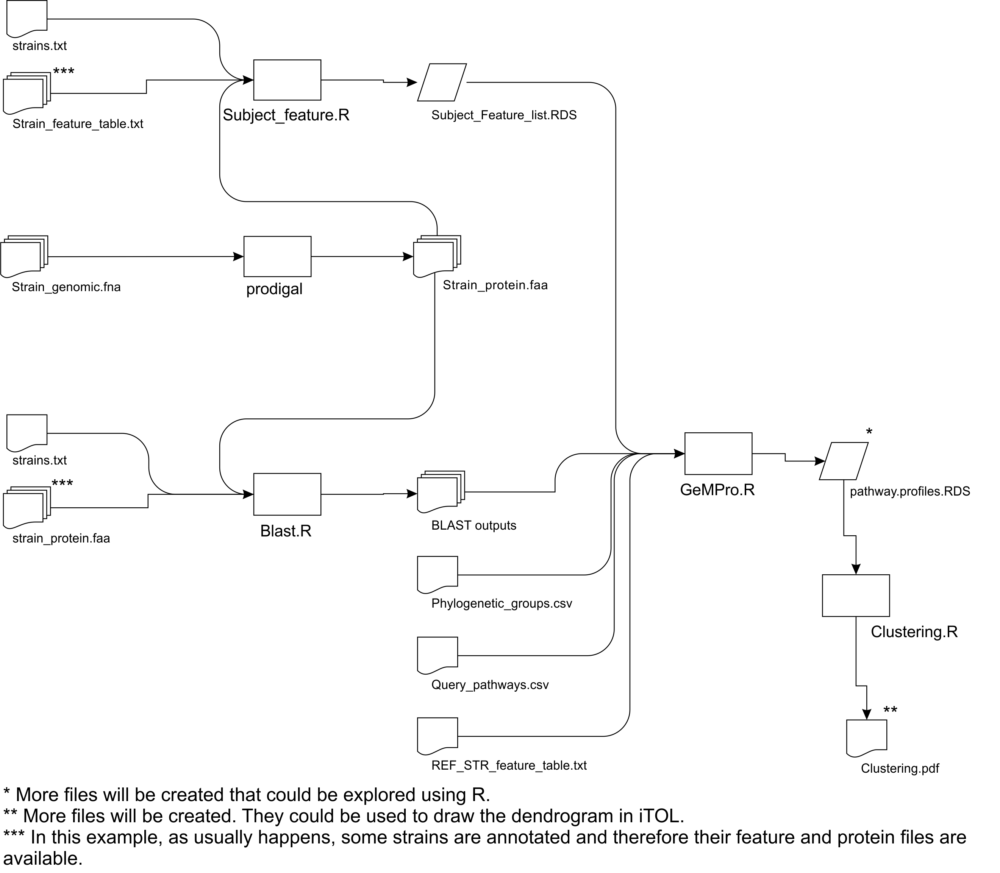

## Case 3 help:

The general pipeline is depicted below.



The pipeline could be executed following the 6 steps described below:

*Step 1.* `Query_pathways.csv`, `strains.txt`, and
`Phylogenetic_groups.csv` files for Case 3 are available at Sample
Folder. They have the “.C3” suffix except `Query_pathways.csv` that is
common to all cases.

*Step 2.* Predict CDS and putative protein sequences by executing the
following command-line sentences in the Sample Folder.

``` bash
prodigal -i Genomes/BA06_genomic.fna -a Proteomes/BA06_protein.faa
```

The file BA06\_protein.faa will be created in Sample/Proteomes Folder (~
7 sec/strain).

*Step 3.* Convert feature files to RDS files, in Sample Folder, by
executing the following command-line
sentences.

``` bash
Rscript ../Rscript/Subject_feature.R strains.C3.txt Features/ _feature_table.txt Proteomes/ _protein.faa
```

*Step 4.* Perform BLAST searches by executing the following command-line
sentences in the Sample
Folder.

``` bash
Rscript ../Rscript/Blast.R FZB42 strains.C3.txt ALL Proteomes/ Blast_out.C3/
```

8 BLAST output files will be created in `Sample/Blast_out.C3` Folder
(~70 sec/strain).

*Step 5.* Run PrOBS by executing the following command-line sentences in
the Sample
Folder.

``` bash
Rscript ../Rscript/PrOBS.R FZB42 Phylogenetic_groups.C3.csv Blast_out.C3/ Query_pathways.csv Subject_Feature_list.RDS Features/FZB42_feature_table.txt PrOBS_out.C3/
```

5 files will be created in `Sample/PrOBS_out.C3` Folder (~2 sec).

`Step 6.` Perform clustering by executing the following command-line
sentences in the Sample Folder.

``` bash
Rscript ../Rscript/Clustering.R PrOBS_out.C2/pathway.profiles.RDS 100
```

3 files will be created in Sample Folder (~2 sec).
