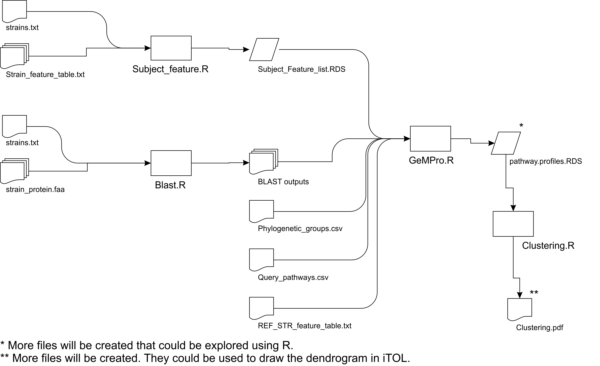

Example Case1
================

## Case 1 help:

The general pipeline is depicted below.



The pipeline could be executed following the 5 steps described below:

*Step 1.* `Query_pathways.csv`, strains.txt, and
Phylogenetic\_groups.csv for Case 1 are available at Sample Folder. They
have the “.C1” suffix except `Query_pathways.csv` that is common to all
cases.

*Step 2.* Convert feature files in Sample Folder to RDS files by
executing the following command-line
sentences.

``` bash
Rscript ../Rscript/Subject_feature.R strains.C1.txt Features/ _feature_table.txt
```

The file `Subject_Feature_list.RDS` will be created in Sample Folder (\<
1 sec). *Step 3.* Perform BLAST searches by executing the following
command-line sentences in the Sample
Folder.

``` bash
Rscript ../Rscript/Blast.R FZB42 strains.C1.txt ALL Proteomes/ Blast_out/
```

7 BLAST output files will be created in Sample/Blast\_out Folder (~70
sec/strain).

*Step 4.* Run GeM-Pro by executing the following command-line sentences
in the Sample
Folder.

``` bash
Rscript ../Rscript/GeMPro.R FZB42 Phylogenetic_groups.C1.csv Blast_out/ Query_pathways.csv Subject_Feature_list.RDS Features/FZB42_feature_table.txt GeMPro_out/
```

5 files will be created in Sample/GeMPro\_out Folder (2 sec).

*Step 5.* Perform clustering by executing the following command-line
sentences in the Sample Folder.

``` bash
Rscript ../Rscript/Clustering.R GeMPro_out/pathway.profiles.RDS 100
```

3 files will be created in Sample Folder (2 sec).
