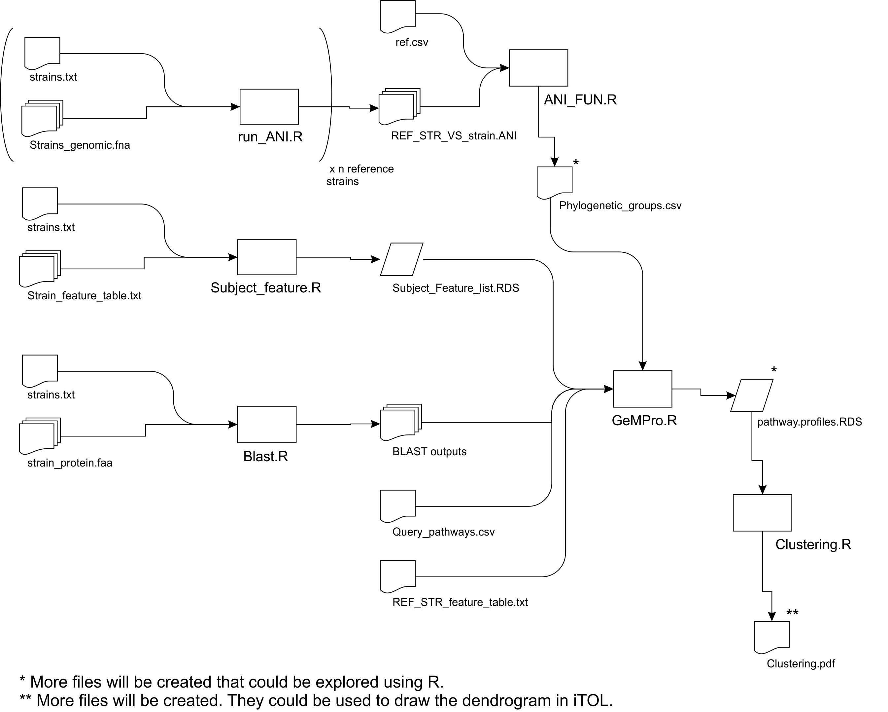

## Case 2 help:

The general pipeline is depicted below.



The pipeline could be executed following the 7 steps described below:

*Step 1.* `Query_pathways.csv`, `ref.csv` and `strains.txt` for Case 2
are available at Sample Folder. Strains.txt file has the “.C2” suffix.

*Step 2.* Compute ANI values between strains and reference strains by
executing the following command-line sentences in the Sample
Folder.

``` bash
Rscript ../Rscript/run_ANI.R 41KF2b strains.C2.txt OAT/ /usr/bin/ 4 Genomes/ ANI.out/
Rscript ../Rscript/run_ANI.R Ames strains.C2.txt OAT/ /usr/bin/ 4 Genomes/ ANI.out/
Rscript ../Rscript/run_ANI.R ATCC_14579 strains.C2.txt OAT/ /usr/bin/ 4 Genomes/ ANI.out/
Rscript ../Rscript/run_ANI.R 168 strains.C2.txt OAT/ /usr/bin/ 4 Genomes/ ANI.out/
Rscript ../Rscript/run_ANI.R NRRL_B_41580 strains.C2.txt OAT/ /usr/bin/ 4 Genomes/ ANI.out/
7 OAT output files will be created for each reference strain in Sample/ANI_out Folder (~215 sec each one).
```

*Step 3.* Circumscribe strains in Phylogenetic groups by executing the
following command-line sentences in the Sample Folder.

``` bash
Rscript ../Rscript/ANI_FUN.R ref.csv strains.C2.txt ANI.out/
```

The file Phylogenetic\_groups.csv will be created in Sample Folder (\< 1
sec).

*Step 4.* Convert feature files in Sample Folder to RDS files by
executing the following command-line
sentences.

``` bash
Rscript ../Rscript/Subject_feature.R strains.C2.txt Features/ _feature_table.txt
```

The file Subject\_Feature\_list.RDS will be created in Sample Folder (~
1 sec).

*Step 5.* Perform BLAST searches by executing the following command-line
sentences in the Sample
Folder.

``` bash
Rscript ../Rscript/Blast.R FZB42 strains.C2.txt ALL Proteomes/ Sample/Blast_out.C2/
```

7 BLAST output files will be created in `Sample/Blast_out.C2` Folder
(~70 sec/strain).

*Step 6.* Run GeM-Pro by executing the following command-line sentences
in the Sample
Folder.

``` bash
Rscript ../Rscript/GeMPro.R FZB42 Phylogenetic_groups.csv Blast_out.C2/ Query_pathways.csv Subject_Feature_list.RDS Features/FZB42_feature_table.txt GeMPro_out.C2/
```

5 files will be created in `Sample/GeMPro_out.c2` Folder (~2 sec).

*Step 7.* Perform clustering by executing the following command-line
sentences in the Sample Folder.

``` bash
Rscript ../Rscript/Clustering.R GeMPro_out.C2/pathway.profiles.RDS 100
```

3 files will be created in Sample Folder (~2 sec).
