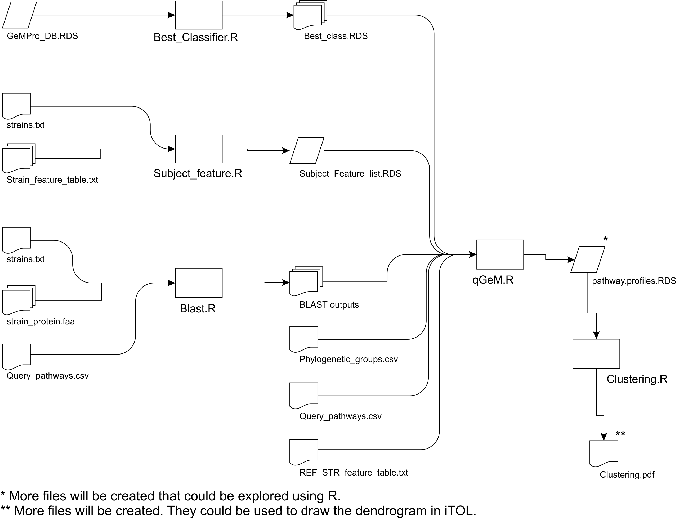

## Case 4 help:

The general pipeline is depicted below.



*Step 1.* Define Best classifier by executing the following command-line
sentences in the Sample Folder.

``` bash
Rscript ../Rscript/Best_Classifier.R PrOBS_DB.C4.RDS Best_Classifiers/
```

4 RDS files will be created in Best\_Classifiers Folder, one for each
phylogenetic group analysed in PrOBS\_DB.C4.RDS (~150 sec).

*Step 2.* `Query_pathways.csv`, strains.txt and
`Phylogenetic_groups.csv` for Case 4 are available at Sample Folder.
They have the “.C4” suffix.

*Step 3.* Convert feature files to RDS files in the Sample Folder by
executing the following command-line
sentences.

``` bash
Rscript ../Rscript/Subject_feature.R strains.C4.txt Features/ _feature_table.txt
```

The file `Subject_Feature_list.RDS` will be created in Sample Folder (~
1 sec).

*Step 4.* Perform BLAST searches by executing the following command-line
sentences in the Sample
Folder.

``` bash
Rscript ../Rscript/Blast.R FZB42 strain.C4.txt Query_pathways.csv Proteomes/ Blast_out.C4/
```

7 BLAST output files will be created in `Sample/Blast_out.C4` Folder (~8
sec/strain).

*Step 5.* Run q-PrOBS by executing the following command-line sentences
in the Sample
Folder.

``` bash
Rscript ../Rscript/qPrOBS.R FZB42 Phylogenetic_groups.C4.csv Blast_out.C4/ Query_pathways.csv Best_classifiers/ Subject_Feature_list.RDS Features/FZB42_feature_table.txt qPrOBS_out/
```

4 files will be created in `Sample/qPrOBS_out` Folder (~8 sec).

*Step 6.* Perform clustering by executing the following command-line
sentences in the Sample Folder.

``` bash
Rscript ../Rscript/Clustering.R qPrOBS_out/pathway.profiles.RDS 100
```

3 files will be created in Sample Folder (~1 sec).
